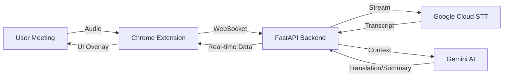

<div align="center">

# 🍌 B-Bridge

**Eliminate Language Barriers. Zero Errors. 100% Productivity.**

[](https://github.com/ticoxz/LanguageBridge)
[](LICENSE)
[](https://chrome.google.com/webstore)
[](https://nextjs.org/)

*Your Invisible Copilot Turning Conversation into Action.*

[Features](#-features) • [Quick Start](#-quick-start) • [Architecture](#-architecture) • [Roadmap](#-roadmap)

</div>

---

## ✨ Features

### 🎤 Real-Time Transcription
- **Live Speech-to-Text** powered by Google Cloud Speech API (<500ms latency).
- **High Accuracy** with automatic punctuation.
- **Privacy First**: Audio processed locally and never stored.

### 🍌 Banana-Themed UI (New!)
- **B-Bridge Branding**: Vibrant yellow/black aesthetic with 🍌 icon.
- **Loading Indicators**: Visual feedback during translation ("Translating..." spinner).
- **Responsive Design**: Minimalist overlay that doesn't obstruct meetings.

### 🌍 Smart Translation & Assist *(Optimized)*
- **Bidirectional**: Spanish ↔ English automatic detection.
- **Split-Flow Architecture**: Translation delivered instantly, smart replies follow.
- **Ultra-Fast**: <2s latency with optimized prompts and parallel processing.
- **Smart Replies**: 2 concise AI suggestions (max 5 words) to keep conversations flowing.

---

## 🚀 Quick Start

### Prerequisites
- **Node.js** 18+
- **Python** 3.9+
- **Google Cloud Account** (Speech-to-Text API)
- **Gemini API Key** (for AI features)

### 1️⃣ Backend Setup (API)

```bash
cd api
python -m venv venv
# Windows: venv\Scripts\activate | Mac/Linux: source venv/bin/activate
pip install -r requirements.txt
cp .env_template .env  # Add your GOOGLE_APPLICATION_CREDENTIALS path and GEMINI_API_KEY
uvicorn main:app --host 0.0.0.0 --port 8080 --reload
```

### 2️⃣ Extension Setup

```bash
cd extension
npm install
npm run build
# Load `dist` folder in chrome://extensions/ (Developer Mode)
```

### 3️⃣ Web Landing Page (Marketing)

```bash
cd web
npm install
npm run dev
# Visit http://localhost:3000
```

---

## 🏗️ Architecture



### Tech Stack

| Component | Tech |
|-----------|------|
| **Extension** | React, TypeScript, Vite, WebSockets |
| **Backend** | Python, FastAPI, Google Cloud STT, Gemini AI |
| **Web** | Next.js 14, Tailwind CSS, Framer Motion |

### Data Flow

1. **Audio Capture**: Extension captures microphone via `getUserMedia`.
2. **Processing**: Downsamples to 16kHz PCM, converts to 16-bit.
3. **Streaming**: Sends audio chunks via WebSocket (`wss://`).
4. **Transcription**: Google Cloud STT processes in real-time.
5. **Context**: Gemini AI analyzes transcript for translation/summaries.
6. **Display**: Results shown in overlay UI via React Portal.

---

## 🗺️ Roadmap

- [x] **MVP Core**: Real-time transcription & WebSocket pipeline.
- [x] **Visual Identity**: "Banana" Branding & Epic Landing Page.
- [x] **Smart Features**: Bidirectional detection & Context awareness.
- [ ] **Cloud Scale**: Deploy backend to Cloud Run.
- [ ] **Monetization**: Integrate Stripe for Pro plans.

---

<div align="center">

**Made with ❤️ by [tico](https://github.com/ticoxz) 🍌**

[⭐ Star on GitHub](https://github.com/ticoxz/LanguageBridge)

</div>
