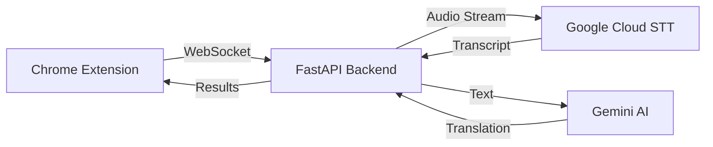

<div align="center">

# 🌉 L-Bridge

**Real-time Meeting Transcription & Translation**

[](https://github.com/ticoxz/LanguageBridge)
[](LICENSE)
[](https://chrome.google.com/webstore)

*Your invisible copilot for multilingual meetings*

[Features](#-features) • [Demo](#-demo) • [Quick Start](#-quick-start) • [Architecture](#-architecture) • [Roadmap](#-roadmap)

</div>

---

## ✨ Features

### 🎤 Real-Time Transcription
- **Live Speech-to-Text** powered by Google Cloud Speech API
- **High Accuracy** with automatic punctuation
- **Low Latency** streaming architecture (<500ms)

### 🌍 Bidirectional Translation *(Coming Soon)*
- **Spanish ↔ English** automatic language detection
- **Smart Replies** powered by Gemini AI
- **Context-Aware** translations for technical meetings

### 🎯 Meeting Platforms
- ✅ Google Meet
- 🔜 Zoom
- 🔜 Microsoft Teams

### 🔒 Privacy First
- **On-Demand Connection** - only active when you need it
- **No Recording** - audio processed in real-time, never stored
- **Local Processing** - sensitive data stays in your control

---

## 🎬 Demo

> **Note**: Translation feature currently in development. Transcription fully functional!

**What it looks like:**
- Minimalist overlay in bottom-right corner
- Real-time transcript updates as you speak
- One-click smart replies (when translation is active)

---

## 🚀 Quick Start

### Prerequisites
- **Node.js** 18+ and npm
- **Python** 3.9+
- **Google Cloud Account** (free tier works!)
- **Gemini API Key** (optional, for translation)

### 1️⃣ Backend Setup

```bash
cd api

# Create virtual environment
python -m venv venv
source venv/bin/activate  # Windows: venv\Scripts\activate

# Install dependencies
pip install -r requirements.txt

# Configure credentials
cp .env_template .env
# Edit .env with your API keys

# Run server
uvicorn main:app --host 0.0.0.0 --port 8080 --reload
```

**Get your credentials:**
- [Google Cloud Speech-to-Text](https://cloud.google.com/speech-to-text/docs/before-you-begin) - Download JSON key
- [Gemini API Key](https://ai.google.dev/) - Free tier available

### 2️⃣ Extension Setup

```bash
cd extension

# Install dependencies
npm install

# Build extension
npm run build

# Load in Chrome
# 1. Go to chrome://extensions/
# 2. Enable "Developer mode"
# 3. Click "Load unpacked"
# 4. Select the `extension/dist` folder
```

### 3️⃣ Start Using

1. **Join a Google Meet**
2. **Click the L-Bridge icon** in bottom-right
3. **Click the microphone** to start listening
4. **Speak!** See real-time transcription

---

## 🏗️ Architecture



### Tech Stack

**Frontend (Extension)**
- React + TypeScript
- Vite
- Web Audio API
- WebSockets

**Backend (API)**
- FastAPI (Python)
- Google Cloud Speech-to-Text
- Google Gemini AI
- Async/Await architecture

### Data Flow

1. **Audio Capture**: Extension captures microphone via `getUserMedia`
2. **Processing**: Downsamples to 16kHz PCM, converts to 16-bit
3. **Streaming**: Sends audio chunks via WebSocket
4. **Transcription**: Google Cloud STT processes in real-time
5. **Translation**: Gemini AI translates final phrases (5+ words)
6. **Display**: Results shown in overlay UI

---

## 📊 Current Status

| Feature | Status |
|---------|--------|
| Real-time Transcription | ✅ Working |
| WebSocket Audio Streaming | ✅ Working |
| Google Cloud STT Integration | ✅ Working |
| Gemini AI Integration | ⚠️ Quota-limited |
| Bidirectional Translation | 🔜 In Progress |
| Smart Replies | 🔜 In Progress |
| Multi-language Support | 🔜 Planned |
| Cloud Deployment | 🔜 Planned |

---

## 🗺️ Roadmap

### Phase 1: MVP ✅
- [x] Real-time transcription
- [x] WebSocket architecture
- [x] Chrome extension
- [x] Basic UI

### Phase 2: Translation 🚧
- [ ] Quota management system
- [ ] Translation caching
- [ ] Language selection UI
- [ ] Smart reply generation

### Phase 3: Scale 📅
- [ ] Deploy backend to Cloud Run
- [ ] Add Redis for caching
- [ ] Support more languages
- [ ] Team/Enterprise features

### Phase 4: Polish 📅
- [ ] Chrome Web Store publish
- [ ] User analytics
- [ ] Feedback system
- [ ] Premium tier

---

## 💡 Usage Tips

**Optimize API Quota:**
- Translation only triggers for phrases with 5+ words
- Quota resets every 24 hours
- Free tier: 60 requests/minute (Gemini Pro)

**Best Practices:**
- Speak clearly and at normal pace
- Wait 1-2 seconds after finishing a sentence
- Use in quiet environments for best accuracy

**Troubleshooting:**
- If transcription stops: Refresh the Meet page
- If no audio: Check microphone permissions
- If quota exceeded: Wait until next day or upgrade

---

## 🤝 Contributing

Contributions welcome! Please:
1. Fork the repository
2. Create a feature branch
3. Make your changes
4. Submit a pull request

---

## 📄 License

MIT License - feel free to use this project for learning or commercial purposes.

---

## 🙏 Acknowledgments

- **Google Cloud** for Speech-to-Text API
- **Google AI** for Gemini API
- **FastAPI** for the amazing framework
- **React** team for the UI library

---

<div align="center">

**Made with ❤️ by [tico](https://github.com/ticoxz)**

[⭐ Star this repo](https://github.com/ticoxz/LanguageBridge) if you find it useful!

</div>
