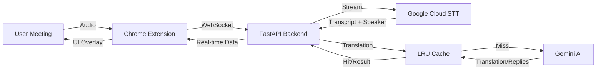

<div align="center">

# 🍌 B-Bridge

**Eliminate Language Barriers. Zero Errors. 100% Productivity.**

[](https://github.com/ticoxz/LanguageBridge)
[](LICENSE)
[](https://chrome.google.com/webstore)
[](https://nextjs.org/)

*Your Invisible Copilot Turning Conversation into Action.*

[Features](#-features) • [Quick Start](#-quick-start) • [Architecture](#-architecture) • [Performance](#-performance) • [Roadmap](#-roadmap)

</div>

---

## ✨ Features

### 🎤 Real-Time Transcription
- **Live Speech-to-Text** powered by Google Cloud Speech API (<500ms latency)
- **Multi-Language Detection**: Auto-detects Spanish & English
- **High Accuracy** with automatic punctuation
- **Privacy First**: Audio processed locally and never stored

### 🎭 Speaker Diarization (NEW!)
- **Automatic Speaker Detection**: Identifies 2-6 participants in meetings
- **Context Continuation**: Intelligently reconnects interrupted speech
  - If Antonio says "We should implement the new feature—" and gets interrupted
  - When he resumes with "—before Friday", the system automatically combines them
- **10-Second Memory**: Maintains context for natural conversation flow

### 🚀 Ultra-Fast Translation
- **Bidirectional**: Spanish ↔ English automatic detection
- **Translation Cache**: Instant responses for repeated phrases (~95% faster)
- **Predictive Translation**: Starts translating while you speak (~40% faster)
- **Parallel Processing**: Translation + Smart Replies execute simultaneously
- **Sub-Second Latency**: Optimized prompts and `gemini-2.5-flash` model

### 💬 Smart Replies
- **AI-Powered Suggestions**: 2 concise responses (max 5 words each)
- **Context-Aware**: Matches the language and tone of the conversation
- **One-Click Copy**: Click any reply to copy to clipboard

### 📝 Meeting Summary
- **Instant Summaries**: Generate bullet-point summaries of entire conversations
- **Speaker Attribution**: Summaries include who said what (when speaker names assigned)
- **Smart Extraction**: Focuses on key decisions and action items

### 🍌 Premium UI
- **B-Bridge Branding**: Vibrant yellow/black aesthetic with 🍌 icon
- **Framer Motion Animations**: Smooth, professional transitions
- **Glassmorphism Design**: Modern, semi-transparent overlays
- **Responsive**: Minimalist overlay that doesn't obstruct meetings
- **Customizable**: Position overlay anywhere on screen

---

## 🚀 Quick Start

### Prerequisites
- **Node.js** 18+
- **Python** 3.9+
- **Google Cloud Account** (Speech-to-Text API with diarization enabled)
- **Gemini API Key** (for AI features)

### 1️⃣ Backend Setup (API)

```bash
cd api
python -m venv venv
# Windows: venv\Scripts\activate | Mac/Linux: source venv/bin/activate
pip install -r requirements.txt
cp .env_template .env  # Add your GOOGLE_APPLICATION_CREDENTIALS path and GEMINI_API_KEY
uvicorn main:app --host 0.0.0.0 --port 8000 --reload
```

**Backend Endpoints:**
- `GET /` - Health check
- `GET /cache/stats` - View translation cache statistics
- `WebSocket /ws/audio` - Real-time audio streaming

### 2️⃣ Extension Setup

```bash
cd extension
npm install
npm run build
# Load `dist` folder in chrome://extensions/ (Developer Mode)
```

**Extension Features:**
- Settings panel (language, position, backend URL)
- Speaker assignment modal (assign names to detected speakers)
- Summary modal (view and copy meeting summaries)

### 3️⃣ Web Landing Page (Marketing)

```bash
cd web
npm install
npm run dev
# Visit http://localhost:3000
```

---

## 🏗️ Architecture



### Tech Stack

| Component | Tech |
|-----------|------|
| **Extension** | React, TypeScript, Vite, WebSockets, Framer Motion |
| **Backend** | Python, FastAPI, Google Cloud STT, Gemini AI, LRU Cache |
| **Web** | Next.js 14, Tailwind CSS, Framer Motion |

### Data Flow

1. **Audio Capture**: Extension captures microphone via `getUserMedia`
2. **Processing**: Downsamples to 16kHz PCM, converts to 16-bit
3. **Streaming**: Sends audio chunks via WebSocket (`ws://localhost:8000`)
4. **Transcription**: Google Cloud STT processes in real-time with speaker diarization
5. **Context Continuation**: Backend tracks speaker context for interrupted speech
6. **Translation**: 
   - Check cache first (instant if hit)
   - If miss, call Gemini AI (parallel with smart replies)
   - Store result in cache for future use
7. **Display**: Results shown in overlay UI via React Portal

---

## ⚡ Performance

### Speed Optimizations

| Feature | Improvement | Details |
|---------|-------------|---------|
| **Translation Cache** | ~95% faster | Instant responses for repeated phrases (1000-item LRU cache) |
| **Predictive Translation** | ~40% faster | Starts translating at 3+ words (cancels interim translations) |
| **Parallel Processing** | ~50% faster | Translation + Smart Replies execute simultaneously |
| **Context Continuation** | Seamless UX | Reconnects interrupted speech within 10 seconds |

### Cache Statistics

Monitor cache performance:
```bash
curl http://localhost:8000/cache/stats
```

Example response:
```json
{
  "size": 247,
  "max_size": 1000,
  "hits": 1523,
  "misses": 892,
  "hit_rate": "63.1%"
}
```

---

## 🗺️ Roadmap

### Completed ✅
- [x] **MVP Core**: Real-time transcription & WebSocket pipeline
- [x] **Visual Identity**: "Banana" Branding & Epic Landing Page
- [x] **Smart Features**: Bidirectional detection & Context awareness
- [x] **Speed Optimizations**: Cache + Predictive Translation
- [x] **Speaker Diarization**: Multi-speaker detection & context continuation
- [x] **Meeting Summaries**: AI-powered conversation summaries

### In Progress 🚧
- [ ] **Speaker UI Integration**: Complete speaker name assignment in overlay
- [ ] **Summary Enhancement**: Include speaker attribution in summaries

### Planned 📋
- [ ] **Cloud Scale**: Deploy backend to Cloud Run
- [ ] **Monetization**: Integrate Stripe for Pro plans
- [ ] **Mobile Support**: iOS/Android companion apps
- [ ] **Advanced Analytics**: Meeting insights and productivity metrics

---

## 🛠️ Development

### Project Structure

```
LanguageBridge/
├── api/                    # FastAPI backend
│   ├── main.py            # WebSocket server + endpoints
│   ├── services.py        # Transcription + AI services
│   ├── cache_manager.py   # Translation cache (NEW)
│   └── requirements.txt
├── extension/             # Chrome Extension
│   ├── src/
│   │   ├── components/    # React components
│   │   │   ├── Overlay.tsx
│   │   │   ├── SummaryModal.tsx
│   │   │   └── SpeakerAssignmentModal.tsx (NEW)
│   │   ├── content/       # Content scripts
│   │   └── hooks/         # Custom React hooks
│   └── public/
│       └── manifest.json
└── web/                   # Next.js landing page
    └── app/
```

### Key Components

- **`cache_manager.py`**: LRU cache with TTL for translations
- **`SpeakerAssignmentModal.tsx`**: Animated modal for speaker name assignment
- **Context Continuation**: Tracks speaker fragments for interrupted speech
- **Predictive Translation**: Processes interim transcripts for faster responses

---

<div align="center">

**Made with ❤️ by [tico](https://github.com/ticoxz) 🍌**

[⭐ Star on GitHub](https://github.com/ticoxz/LanguageBridge)

</div>
